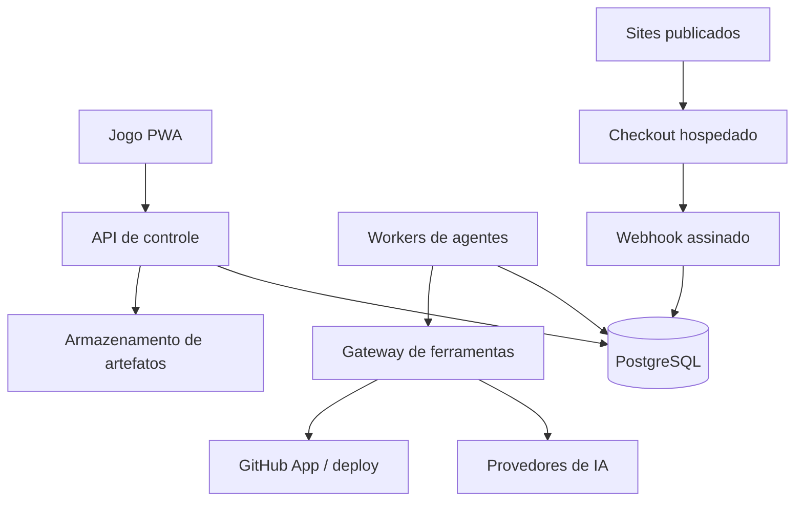

# Arquitetura de servidor do AgentsEnterprise

## Resultado pretendido

O navegador continua sendo o jogo, mas deixa de ser a autoridade operacional. O servidor mantém empresas, agentes, filas, artefatos, orçamento e auditoria; workers continuam produzindo quando a tela está apagada. Sites e produtos só chegam ao público por pipelines versionados, e vendas reais são confirmadas exclusivamente por eventos assinados do processador de pagamentos.

## Princípios imutáveis

1. O objetivo máximo é criar empresas de agentes de IA que produzam produtos e serviços reais, utilizáveis, vendáveis ou distribuíveis pelo proprietário.
2. Toda decisão busca simultaneamente o menor custo real e a maior qualidade. Economia nunca autoriza truncamento, saída parcial tratada como completa ou produto medíocre.
3. O caixa é lastreado no saldo real do provedor. Cada empresa recebe uma alocação por percentual ou valor menor ou igual ao orçamento disponível.
4. Modelos econômicos recebem ferramentas determinísticas e contexto suficiente. Modelo avançado é escalonamento excepcional e auditável.
5. Cada agente atua na própria especialidade. Líderes delegam primeiro, produzem quando não há subordinado apto e consultam a gerente geral fora de sua alçada.
6. Acervos do proprietário são soberanos e imutáveis para agentes. Toda derivação conserva linhagem e toda alteração exige decisão explícita do proprietário.
7. Agentes não inventam ações humanas ou externas. Contato, contrato, identidade fiscal, publicação crítica, preço, reembolso e dados bancários obedecem a ferramentas autorizadas e gates humanos definidos.
8. Todo centavo, token, modelo, ferramenta, artefato, deploy, venda e decisão possui trilha de auditoria append-only.

O banco de dados instala esses princípios como constituição versionada e impede `UPDATE` ou `DELETE` por trigger.

## Componentes

- **Jogo PWA:** mapa, HUD e comandos. Mantém cache para uso offline, mas sincroniza por versão/ETag.
- **API de controle:** autenticação, autorização, comandos, consultas, upload e downloads assinados. Não executa turnos longos.
- **PostgreSQL:** fonte de verdade e fila durável. Jobs são reclamados com `FOR UPDATE SKIP LOCKED` e lease renovável.
- **Workers:** um processo pode executar muitos agentes, porém cada agente possui lease próprio, memória, orçamento e telemetria. Concorrência por empresa e provedor é limitada sem serializar toda a equipe.
- **Gateway de ferramentas:** oferece operações tipadas e autorizadas. Agentes não recebem internet irrestrita; busca, leitura, GitHub e deploy têm allowlist, limites, timeout e log integral.
- **Armazenamento:** S3 compatível em produção e volume local apenas no desenvolvimento. Banco guarda hash, metadados e chave do objeto, não blobs grandes.
- **Comércio:** catálogo e preço pertencem ao servidor. O site solicita uma sessão de checkout; somente webhook assinado cria pedido pago e libera download.

## Autoridade e segurança

| Operação | Autoridade | Gate |
|---|---|---|
| Produzir/revisar artefato interno | agente ou líder do setor | orçamento e especialidade |
| Promover candidato a produto | gerente geral | validação determinística e auditoria |
| Alterar acervo soberano | proprietário | sempre explícito |
| Primeiro deploy/domínio | proprietário | autorização explícita |
| Atualização de site já autorizado | gerente geral | testes, diff e rollback disponíveis |
| Definir preço, política de reembolso e impostos | proprietário | sempre explícito |
| Criar checkout para preço aprovado | servidor | produto publicado e ativo |
| Marcar pedido pago | webhook assinado | evento idempotente |
| Reembolso, payout manual ou mudança bancária | proprietário no provedor | nunca pelo agente |

Segredos ficam no secret manager do ambiente. O banco guarda apenas referências cifradas/identificadores externos. O cliente nunca recebe chaves OpenRouter, Stripe ou GitHub. Tokens GitHub devem vir de uma GitHub App com permissões mínimas e curta duração; deploy de infraestrutura deve preferir OIDC e credenciais efêmeras.

## Comércio real

Como todas as empresas do jogo pertencem inicialmente ao mesmo proprietário legal, a primeira versão usa uma conta Stripe padrão, não Stripe Connect. Empresas e produtos são separados por `metadata`, catálogo e ledger interno. Connect só passa a ser necessário se a plataforma futuramente pagar outros vendedores.

Fluxo de uma venda:

1. O site público envia `productId` e `priceId` ao servidor.
2. O servidor confere produto publicado, preço aprovado, estoque/licença e domínio permitido.
3. O servidor cria Checkout hospedado com chave idempotente e URL de retorno.
4. O cliente paga no processador; o site não toca em dados de cartão.
5. O webhook verifica assinatura e grava o evento externo uma única vez.
6. Uma transação cria pedido, receita bruta, taxas, impostos, receita líquida e direito de download.
7. O processador transfere saldo disponível para a conta bancária configurada conforme a agenda de payouts. O sistema apenas reconcilia IDs, valores e estados.

Produtos digitais exigem configuração fiscal real. Antes de ativar modo live, o proprietário define entidade, país, política de reembolso, termos, privacidade, códigos tributários e registros aplicáveis. Nenhum agente pode presumir essas informações.

## Deploy de sites

- Cada produto/site é um bundle imutável com manifest, SHA-256 e validação de referências locais.
- Preview roda em origem isolada, com CSP e sem acesso a cookies da aplicação.
- Deploy cria uma revisão; nunca sobrescreve o último bundle sem histórico.
- GitHub Pages usa repositório/branch controlados por GitHub App. Infraestrutura do servidor usa ambiente protegido e OIDC quando o provedor suportar.
- Falha de deploy mantém a versão anterior ativa e abre um incidente; não marca publicação como concluída.

## Migração incremental

1. **Controle e persistência:** subir PostgreSQL, API de health/snapshot/comandos e importar o `localStorage` uma única vez.
2. **IA no servidor:** mover chaves, roteamento, orçamento e telemetria para a API; o cliente deixa de chamar provedores.
3. **Worker durável:** portar fila, claims, backoff, handoffs e revisão para jobs. A tela passa a observar eventos via SSE/WebSocket.
4. **Artefatos:** upload/download assinado, versões imutáveis, preview isolado e ZIP reproduzível.
5. **Deploy:** GitHub App, repositórios por empresa, ambientes, rollback e domínio.
6. **Comércio:** catálogo, Checkout em modo teste, webhooks, downloads; modo live somente após checklist jurídico/fiscal do proprietário.

Durante a migração, o cliente atual continua funcionando. Cada capacidade ganha uma flag; nunca existirão dois motores escrevendo na mesma empresa ao mesmo tempo.

## Critério de conclusão da migração

- Fechar o navegador não interrompe jobs em execução.
- Reiniciar API ou worker não perde nem duplica tarefa.
- Duas instâncias não executam o mesmo job.
- Chaves não aparecem em HTML, JavaScript, logs ou exportações do jogador.
- Custo do provedor concilia com o ledger por chamada e por artefato.
- Deploy tem hash, autor, diff, status e rollback.
- Pedido só fica pago após webhook válido e idempotente.
- Produto baixado é exatamente o bundle publicado e adquirido.

